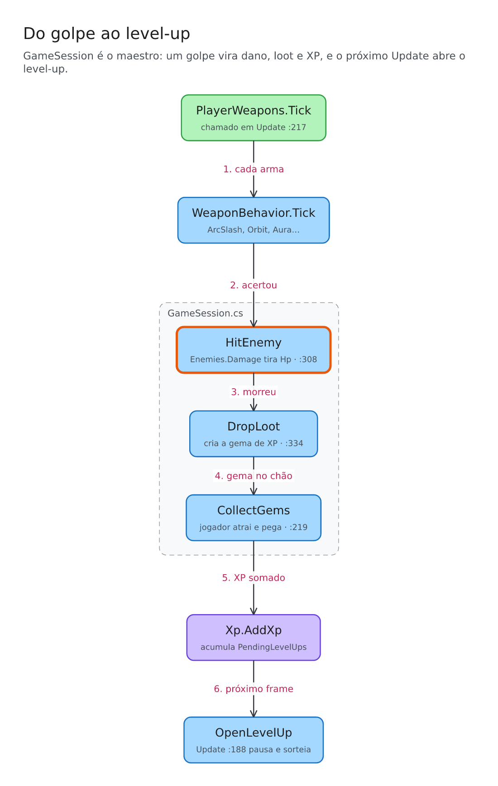

# code-sketch

A [Claude Code](https://claude.com/claude-code) skill that **explains code by drawing it**.
Point it at a function, a call flow or a few modules and it generates a small, editable
[Excalidraw](https://excalidraw.com) diagram, checks the result by looking at a PNG preview, and walks you through it in chat.

<p align="center"></p>

*(Real example: a Vampire Survivors-style game. The diagram was generated from the source code.)*

It is language-agnostic: Claude reads the code, whatever the language, and the script only ever sees a small description of the diagram.

## How it works

1. Claude reads the code and writes a short **spec**: nodes, arrows and groups.
2. A script (`sketch.mjs`) does the rest: lays everything out, sizes the boxes and binds the arrows to them,
   so dragging a box in Excalidraw makes its arrows follow.
3. The script also renders a PNG. Claude looks at it, fixes what looks wrong, and only then hands you the `.excalidraw` file.
4. Finally it explains the diagram in a few lines, pointing at `file:line`.

**Small diagrams on purpose.** The script rejects diagrams with more than 12 nodes, too many arrows, too many branches or loops, or crossing
arrows, and says how to shrink them (draw one phase per diagram, split into an overview plus zoom-ins, merge nodes, use groups instead of arrows).
A diagram nobody can take in at a glance does not help anyone understand code.

## Install

Requires Node 18+. Dependencies (`elkjs`, `@resvg/resvg-js`) install themselves on first run.

As a Claude Code plugin:

```
/plugin marketplace add EduardoMilani8/code-sketch
/plugin install code-sketch@code-sketch
```

Or copy the skill:

```bash
git clone https://github.com/EduardoMilani8/code-sketch
cp -r code-sketch/skills/code-sketch ~/.claude/skills/
```

## Use

Just ask:

> Explain how enemy spawning works in this project with an Excalidraw diagram.

Files go to one fixed folder, `~/code-sketch-diagrams/` (change it with the `CODE_SKETCH_DIR` environment variable or `--out`).
Each diagram is named after its title (`.excalidraw` plus a `.png` preview), and the newest one is always copied to
`~/code-sketch-diagrams/latest.excalidraw`, so you always know where to find it. Open it by dragging it onto
excalidraw.com, or with the "Excalidraw" VS Code extension.

### The spec

This is what Claude writes (the diagram above comes from a spec like it):

```json
{
  "title": "From hit to level-up",
  "takeaway": "GameSession is the conductor: a hit becomes damage, loot and XP.",
  "nodes": [
    { "id": "hit",  "label": "HitEnemy", "sub": "GameSession.cs:308", "focus": true },
    { "id": "loot", "label": "DropLoot", "sub": "GameSession.cs:334" }
  ],
  "edges": [{ "from": "hit", "to": "loot", "label": "killed" }]
}
```

You can also run the script directly:

```bash
node skills/code-sketch/scripts/sketch.mjs my-spec.json
```

The full format is in [`SKILL.md`](skills/code-sketch/SKILL.md); two complete specs are in
[`references/examples`](skills/code-sketch/references/examples).

## Limitations (v0.1)

Flow and structure diagrams only (no sequence diagrams yet). The PNG preview uses a plain font; in Excalidraw the
drawing shows in the hand-drawn style. Plain chains wrap into a snake of rows; branching diagrams with several groups can still come out tall.

## License

MIT
